# AWS CloudWatch

## ¿Qué es?

AWS CloudWatch es un servicio que te ayuda a supervisar tus aplicaciones y la infraestructura, como posibles fallos, rendimiento, cambios realizados, y recursos utilizados. Además, permite configurar alarmas para hacer un mejor seguimiento y reaccionar ante ciertos eventos.

Entre los beneficios de CloudWatch están la automatización de alertas, la visibilidad completa de los recursos que se están usando, y la monitorización proactiva para anticiparse a problemas y mejorar la experiencia de los usuarios.

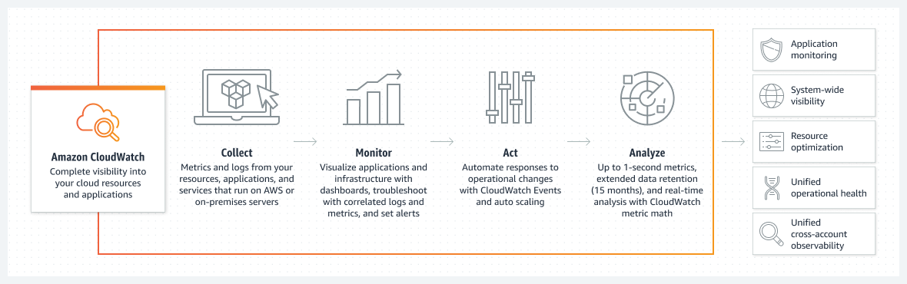

### ¿Por qué es necesario?

CloudWatch es súper importante porque nos permite detectar eventos, como comportamientos sospechosos, y generar alertas automáticas. Podemos procesar estas alertas manualmente o conectarlas a una función Lambda para que ejecute un código de corrección o nos avise automáticamente. Además, configurar diferentes tipos de eventos nos da flexibilidad para gestionar el servicio según nuestras necesidades.

Tener métricas de los triggers también es clave, ya que nos ayudará a futuro a analizar con qué frecuencia ocurren estos eventos y a tomar decisiones sobre cómo maximizar el uso de otros servicios de AWS o reducirlos para optimizar costos.

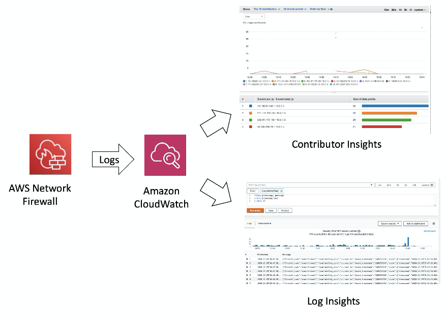

## Estimación de costos

Para estimar los costos se utilizara la calculadora de AWS, en esta se colocaran valores estimados para nuestro caso de estudio, como numero de métricas, recurrencia de los eventos y seguimiento a los Logs

1. Región: US East (ohio)

2. Metrics: 10 métricas  como: Eventos sospechosos en los Logs, alertas generadas, uso de memoria, número de intentos fallidos de iniciar sesión, entre otros

3. APIs

| Concepto                   | Configuración | Comentario                                               |
|----------------------------|---------------|----------------------------------------------------------|
| Get metric Data            | 40320         | Ya que son unos 144 llamadas por día y son 10 métricas   |
| Get Metric Widget Image    | 500           | Número de llamadas para actualizar dashboard             |
| Number of other API request | 100           | Por si otras herramientas necesitan hacer llamados       |

4. Logs: para almacenar las llamadas, se va a agregar una gran capacidad ya que los Logs suelen manejar gran cantidad de datos

| Concepto                    | Configuración |
|-----------------------------|---------------|
| Estándar Logs               | 10 GB         |
| Logs Delivered to CloudWatch | 10 GB         |
| Logs Delivered to S3        | 10 GB         |

5. Dashboards and Alarms: esta configuración es muy importante ya que nos permitirá ver las analítica y alertas que se generen

| Concepto                                                   | Configuración |
|------------------------------------------------------------|---------------|
| Number of Dashboards                                       | 2             |
| Number of estándar Resolution Alarm Metric                 | 60 segundos   |
| Number of high Resolution Alarm Metric                     | 10 segundos   |
| Number of composite alarms                                 | 2             |
| Number of alarms defined with a Metrics Insights query     | 2             |
| Average number of metrics scanned by each metrics Insights query | 10         |

**Con la información anterior los costos son:**

| Concepto                                       | Costo Mensual |
|------------------------------------------------|---------------|
| CloudWatch Metrics cost (Monthly)              | 3 USD         |
| CloudWatch API requests cost (Monthly)         | 0.41 USD      |
| CloudWatch Logs Ingested and Storage cost (Monthly) | 12.59 USD |
| CloudWatch Dashboards and Alarms cost (Monthly) | 12 USD        |
| **Total**                                      | **28 USD**    |

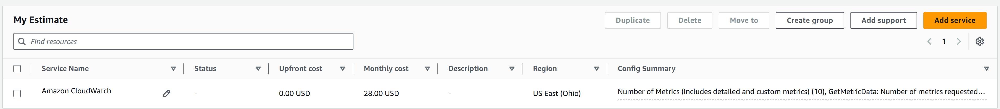

## Pasos detallados para despliegue

Para el despliegue del servicio cloudwatch necesaria en nuestro caso es el siguiente:

1. Seleccionar el servicio de monitoreo CLoudWatch

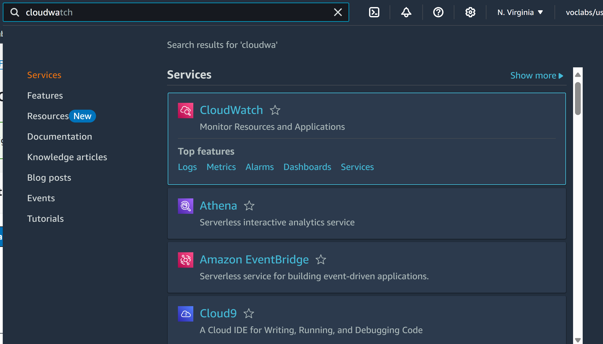

2. Configurar alarmas

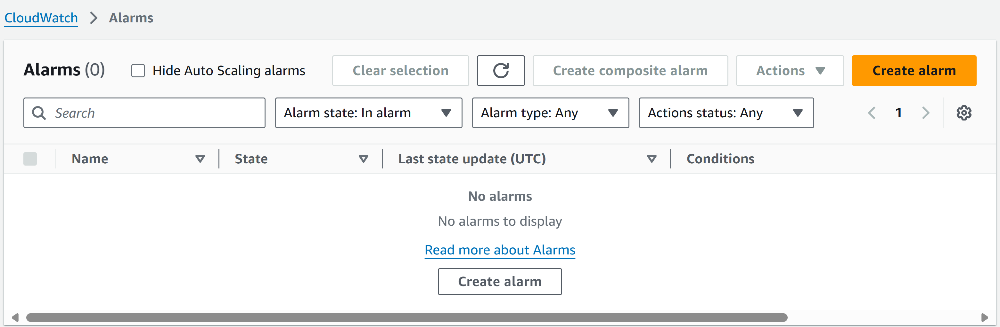

3. Seleccionar métrica 

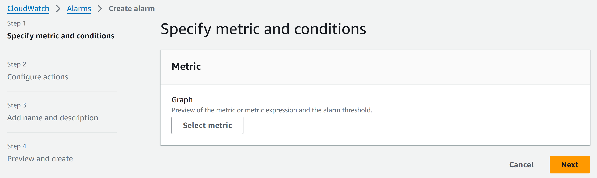

4. Seleccionar Logs

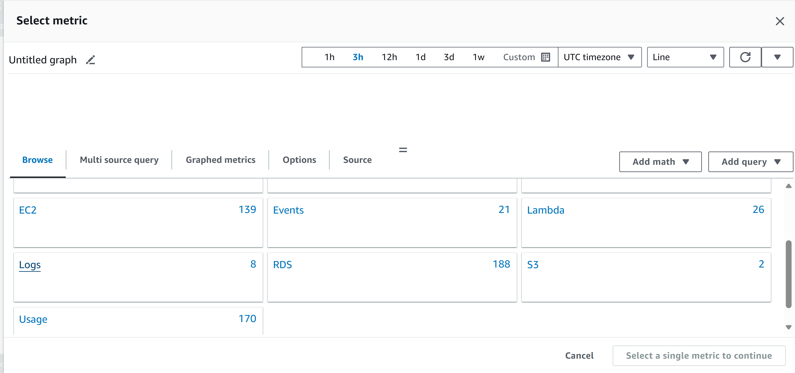

5. Seleccionar métrica

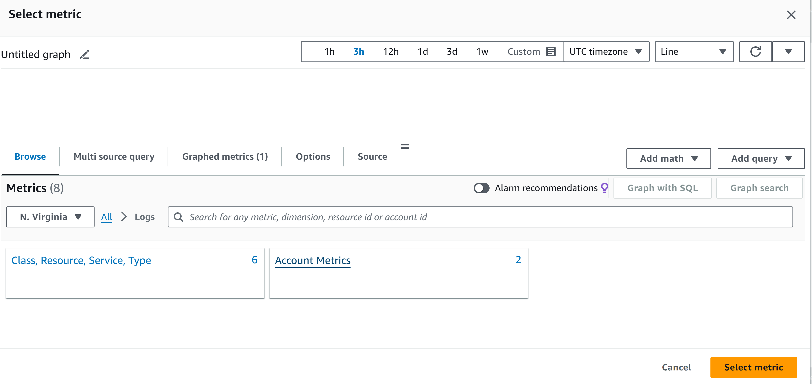

6. Seleccionar botón "Select Metric"

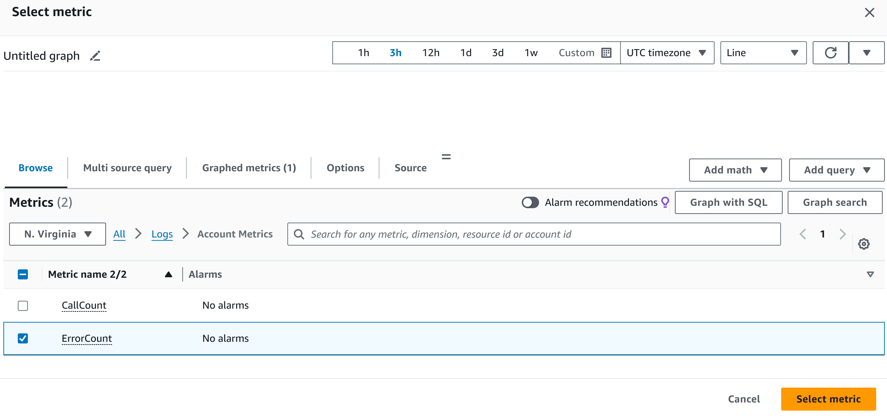

7. Especificar condiciones de la métrica

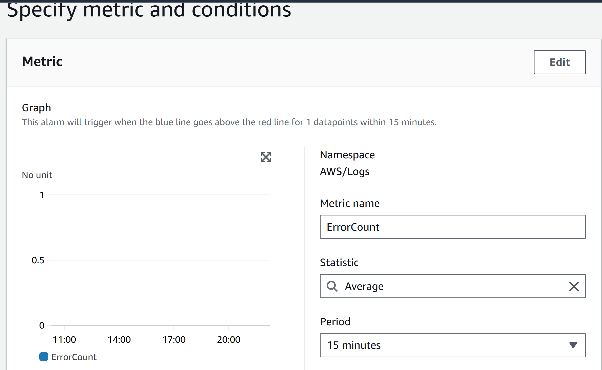

8. Configurar condición de lanzamiento de la métrica

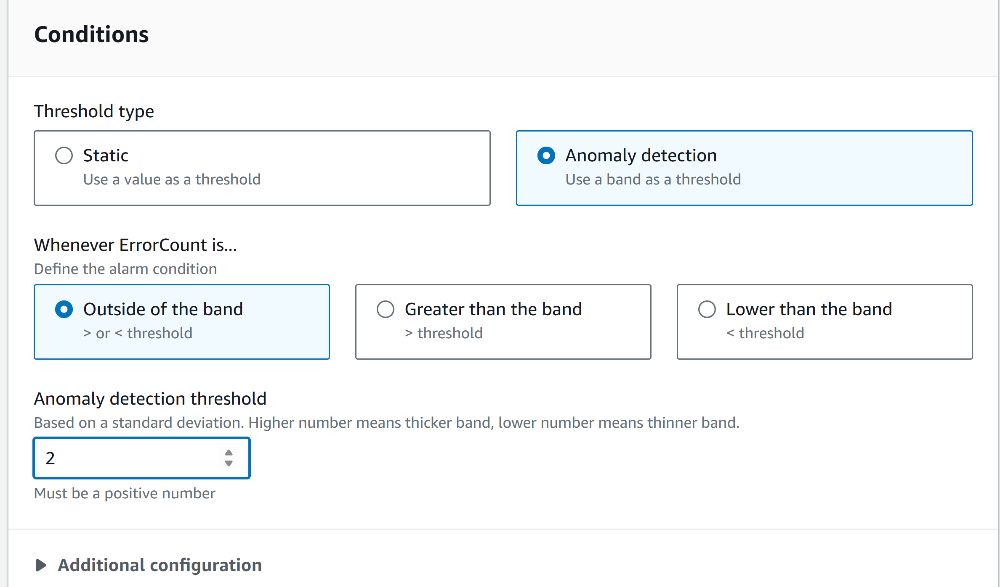

9. Configurar notificación

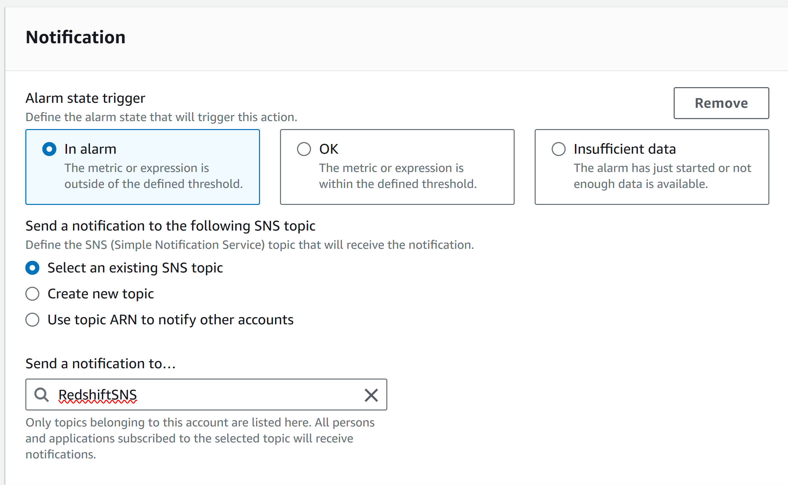

10. Agregar Lambda action: seleccionar la función lambda previamente configurada

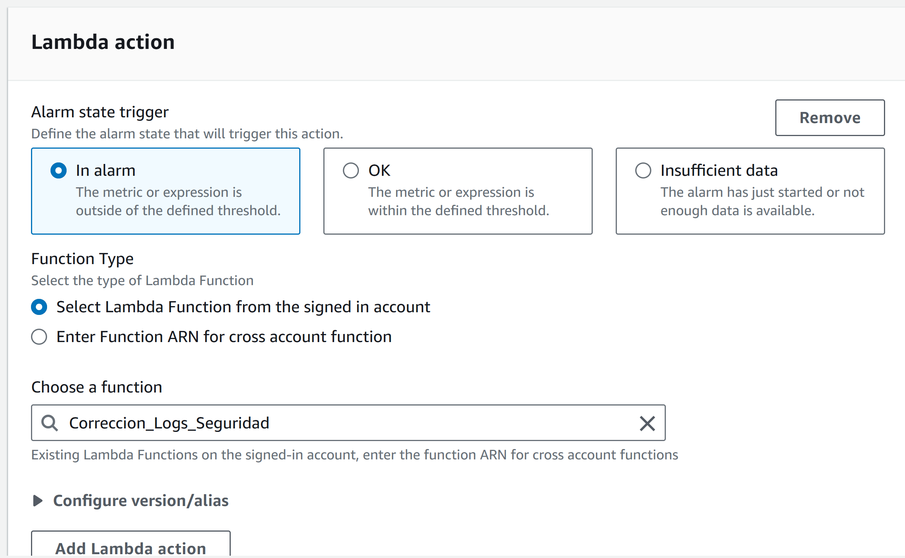

11. Agregar descripción de la alarma

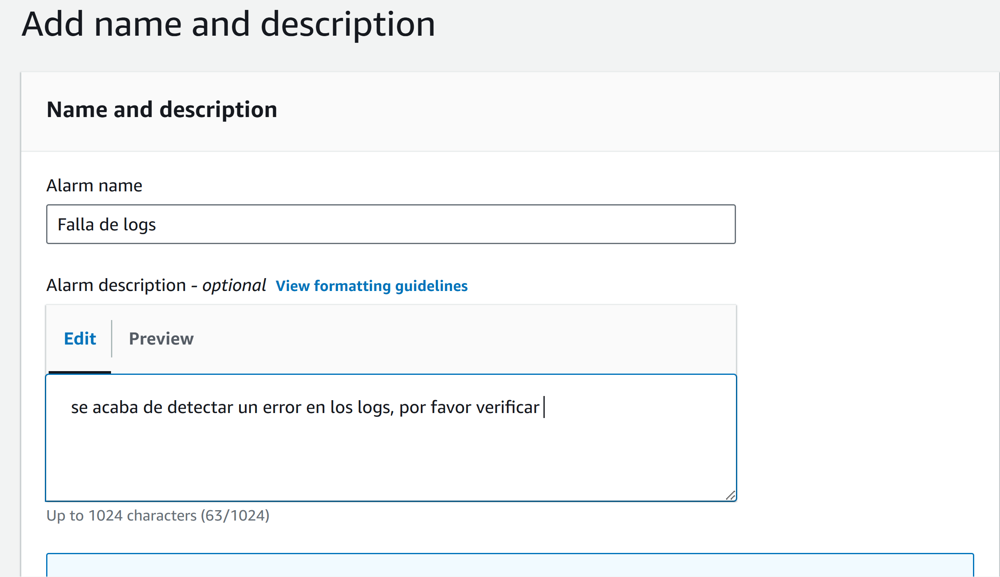

12. Crear alarma

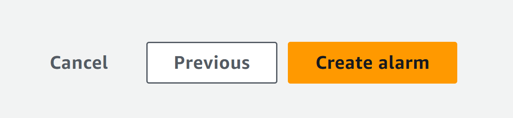

**Con la configuración anterior se contara con la primera alerta, es necesario repetir la acción para las demás alertas y ya estara la configuración para hacer seguimiento de seguridad de los Logs.**