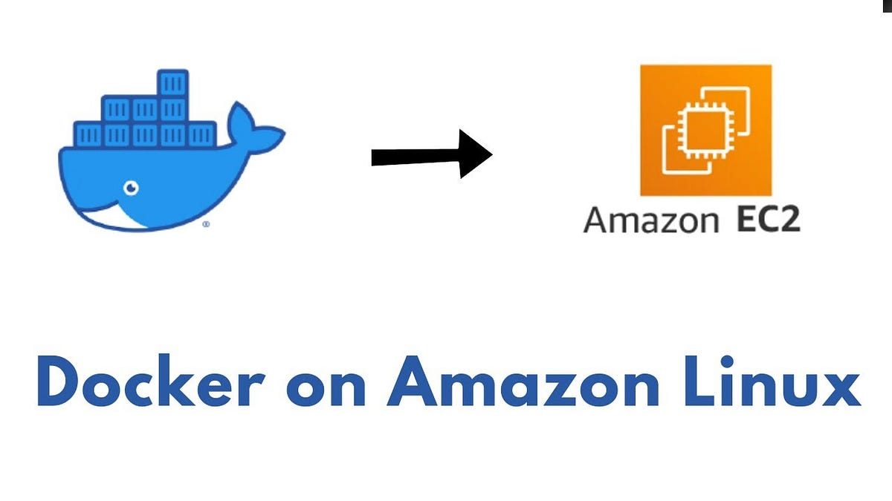
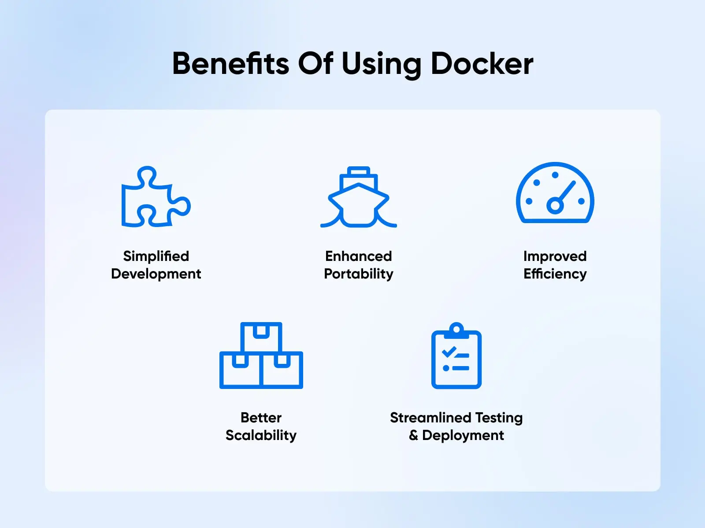
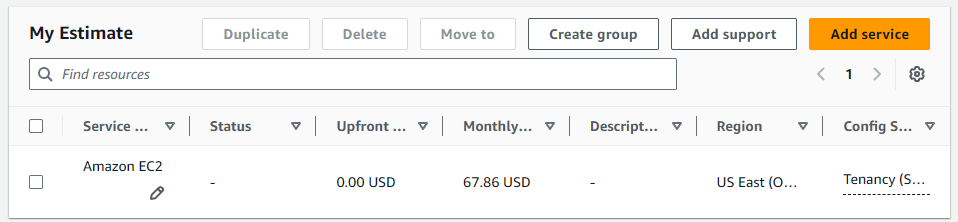

# Docker

## ¿Qué es?

Docker es una plataforma que permite desarrollar, desplegar y ejecutar aplicaciones dentro de contenedores. Los contenedores son entornos ligeros y portátiles que incluyen todo lo necesario para que una aplicación funcione correctamente: código, bibliotecas, dependencias y configuraciones. Esto asegura que la aplicación se ejecute de manera consistente en cualquier entorno, ya sea en desarrollo, pruebas o producción.

En el contexto de AWS, Docker se puede utilizar en instancias EC2 para ejecutar aplicaciones contenerizadas. Esto simplifica el proceso de despliegue y gestión de aplicaciones, ya que elimina problemas relacionados con diferencias en entornos o configuraciones. Además, facilita la escalabilidad y el mantenimiento de las aplicaciones.

**Ventajas de usar Docker en EC2:**

- **Portabilidad**: Los contenedores pueden ejecutarse en cualquier sistema que tenga Docker instalado.
- **Escalabilidad**: Facilita el despliegue de múltiples instancias y el escalado horizontal.
- **Aislamiento**: Cada contenedor funciona de manera independiente, lo que aumenta la seguridad y confiabilidad.
- **Eficiencia**: Los contenedores son más ligeros que las máquinas virtuales tradicionales, consumiendo menos recursos.



### ¿Por qué es necesario?

En nuestro proyecto, necesitamos procesar grandes volúmenes de logs y ejecutar algoritmos de detección de amenazas desarrollados en Python. Al contenerizar estos algoritmos con Docker y desplegarlos en instancias EC2, obtenemos varios beneficios:

- **Despliegue Consistente**: Aseguramos que el entorno de ejecución sea el mismo en desarrollo, pruebas y producción, eliminando errores por diferencias en configuraciones o dependencias.
- **Actualizaciones Sencillas**: Podemos actualizar o desplegar nuevas versiones de los algoritmos sin interrumpir el servicio, simplemente reemplazando los contenedores.
- **Escalabilidad**: Al utilizar instancias EC2 con Docker, podemos escalar horizontalmente agregando más instancias según la demanda.
- **Eficiencia Operativa**: Simplificamos el proceso de implementación y gestión de los algoritmos, reduciendo el tiempo y esfuerzo requerido por el equipo de operaciones.

Además, al integrar Docker con otros servicios de AWS como Amazon S3, Amazon RDS y Amazon CloudWatch, podemos construir una arquitectura robusta y flexible que se adapte a las necesidades cambiantes de la empresa.



## Estimación de costos

Para estimar los costos asociados al uso de Docker en instancias EC2, utilizaremos la calculadora de AWS y consideraremos valores estimados específicos para nuestro caso de estudio, como el tipo de instancia, número de instancias, almacenamiento y otros factores relevantes.

1. **Región**: US East (Ohio)

2. **Tipo de instancia EC2**:

   | Concepto       | Configuración                 | Comentario                            |
   | -------------- | ----------------------------- | ------------------------------------- |
   | Instancia      | `c5.large` (2 vCPU, 4 GB RAM) | Suficiente para el procesamiento logs |
   | Costo por hora | Aproximadamente $0.042        | Por instancia                         |

3. **Número de instancias**:

   | Concepto | Configuración | Comentario                                   |
   | -------- | ------------- | -------------------------------------------- |
   | Cantidad | 2 instancias  | Para alta disponibilidad y balanceo de carga |

4. **Horas mensuales de operación**:

   | Concepto       | Configuración | Comentario                              |
   | -------------- | ------------- | --------------------------------------- |
   | Total de horas | 730 horas     | Asumiendo operación 24/7 durante un mes |

5. **Cálculo del costo de las instancias EC2**:

   | Concepto                   | Cálculo               | Costo  |
   | -------------------------- | --------------------- | ------ |
   | Costo por instancia        | $0.042 x 730 horas    | $30.66 |
   | Costo total (2 instancias) | $30.66 x 2 instancias | $61.32 |

6. **Almacenamiento EBS**:

   | Concepto         | Configuración                  | Costo |
   | ---------------- | ------------------------------ | ----- |
   | Tipo de volumen  | General Purpose SSD (gp2)      |       |
   | Tamaño           | 50 GB por instancia            |       |
   | Costo por GB/mes | $0.10                          |       |
   | Costo total      | 50 GB x $0.0654 x 2 instancias | $6.54 |

7. **Datos de transferencia**:

   - **Asunción**: El tráfico de salida está dentro del nivel gratuito o es mínimo, por lo que no se considera en el cálculo.

**Con la información anterior los costos son:**

| Concepto                              | Costo Mensual |
| ------------------------------------- | ------------- |
| Costo de instancias EC2 (mensual)     | $61.32        |
| Costo de almacenamiento EBS (mensual) | $6.54         |
| **Total**                             | **$67.86**    |



## Pasos detallados para despliegue

A continuación, se presentan los pasos para desplegar los algoritmos contenerizados con Docker en instancias EC2:

### 1. Lanzamiento de instancias EC2

> Seguir los pasos detallados para despliegue de [lanzamiento de instancias EC2](ec2.md) para crear las instancias necesarias.

### 2. Instalación de Docker en EC2

Una vez que las instancias estén en ejecución:

1. **Conectarse a la instancia vía SSH**:

   ```bash
   ssh -i "ruta/clave.pem" ec2-user@<dirección-ip-de-la-instancia>
   ```

2. **Actualizar los paquetes del sistema**:

   ```bash
   sudo yum update -y
   ```

3. **Instalar Docker**:

   ```bash
   sudo amazon-linux-extras install docker -y
   ```

4. **Iniciar el servicio Docker**:

   ```bash
   sudo service docker start
   ```

5. **Agregar el usuario actual al grupo docker**:

   ```bash
   sudo usermod -a -G docker ec2-user
   ```

6. **Verificar la instalación**:

   ```bash
   docker --version
   ```

### 3. Despliegue de los algoritmos contenerizados

1. **Crear un Dockerfile** que defina el entorno y las dependencias de la aplicación Python.

   ```Dockerfile
   FROM python:3.8-slim

   WORKDIR /app

   COPY requirements.txt ./
   RUN pip install --no-cache-dir -r requirements.txt

   COPY . .

   CMD ["python", "main.py"]
   ```

2. **Transferir los archivos necesarios** a la instancia EC2:

   - Utilizar `scp` o herramientas como **AWS S3** para subir los archivos de la aplicación (`main.py`, `requirements.txt`, etc.).

3. **Construir la imagen Docker**:

   ```bash
   docker build -t deteccion-amenazas .
   ```

4. **Ejecutar el contenedor**:

   ```bash
   docker run -d --name app-deteccion deteccion-amenazas
   ```

   - El flag `-d` ejecuta el contenedor en segundo plano.
   - Puede mapear puertos si es necesario (e.g., `-p 80:80`).

### 4. Automatización y escalabilidad

- **Scripts de inicio**:

  - Crear scripts que automaticen la instalación de Docker y el despliegue de contenedores al iniciar la instancia.

- **Auto Scaling Group**:

  - Configurar un **Auto Scaling Group** para manejar aumentos en la carga de trabajo.
  - Definir políticas de escalado basadas en métricas como uso de CPU, memoria, etc.

### 5. Pruebas y validación

- **Verificar que el contenedor está corriendo**:

  ```bash
   docker ps
  ```

- **Probar la aplicación**:

  - Enviar datos de prueba y verificar que se procesan correctamente.
  - Asegurar que los resultados son los esperados.

- **Revisar logs**:

  - Utilizar `docker logs app-deteccion` para revisar los logs del contenedor.

### 6. Mantenimiento y actualizaciones

- **Actualización de la aplicación**:

  - Construir nuevas imágenes Docker con las actualizaciones.
  - Reiniciar los contenedores con la nueva imagen.

- **Gestión de imágenes**:

  - Limpiar imágenes y contenedores antiguos para liberar espacio.
  - Utilizar un registro de contenedores como **Amazon ECR** para almacenar y gestionar imágenes.
