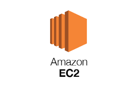

# EC2

## ¿Qué es?

Amazon EC2 (Elastic Compute Cloud) es un servicio de Amazon Web Services (AWS) que proporciona capacidad de cómputo elástica en la nube. Permite a los usuarios lanzar y gestionar instancias de servidores virtuales de forma flexible, según las necesidades de procesamiento de su aplicación.

En este caso, EC2 se utilizará para el procesamiento de logs de seguridad por lotes. Se elegirán instancias de acuerdo con la demanda, lo cual permite ajustar los recursos a las necesidades en tiempo real, optimizando costos y rendimiento.

### ¿Por qué es necesario?

## Estimación de costos

## Pasos detallados para despliegue
