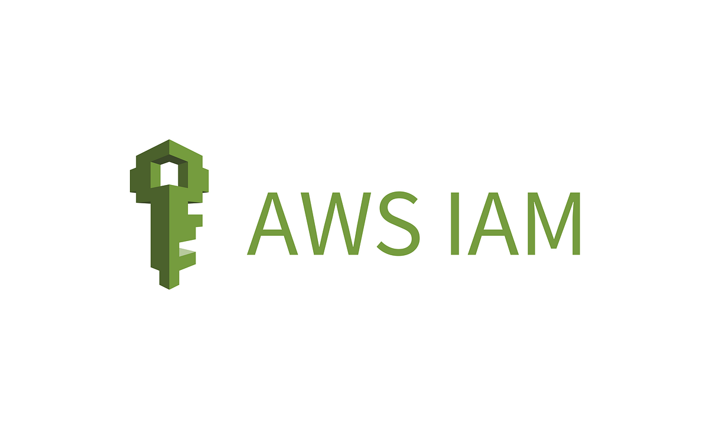
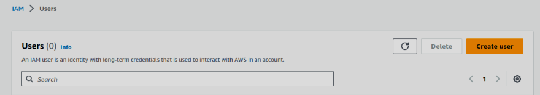
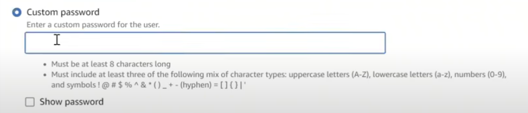
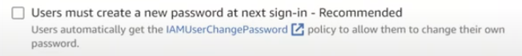
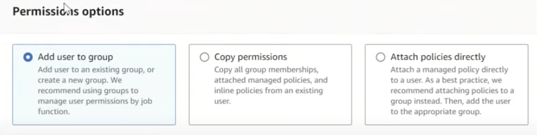
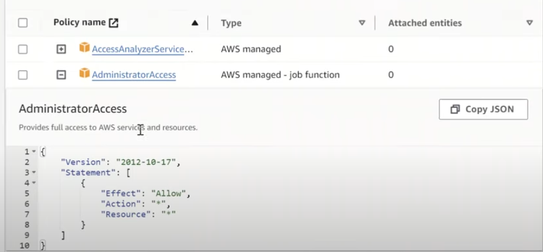
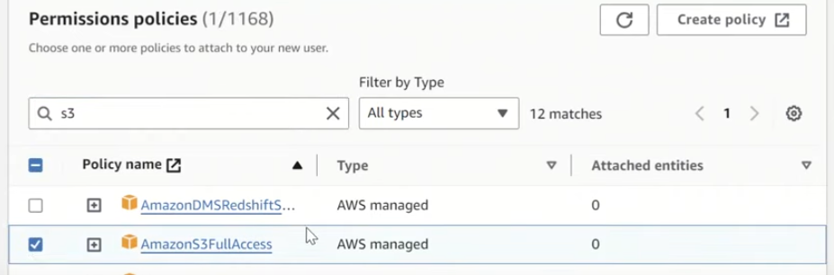
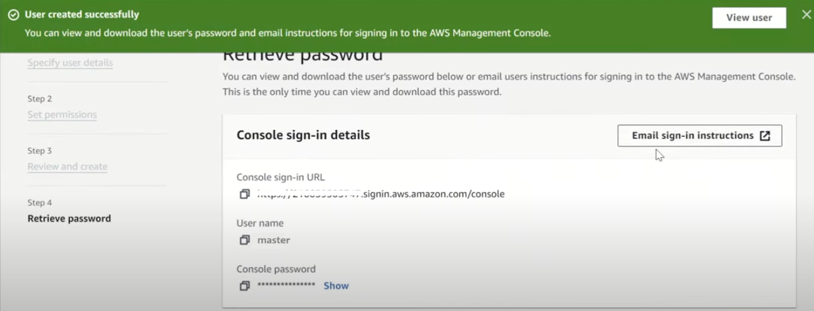

# AWS IAM
## ¿Qué es?
Es un servicio web que permite administrar de manera segura el control de acceso a los recursos de AWS autorizando a los usuarios que se encuentren autenticados y definiendo los permisos especificos para cada uno de ellos. Permite crear una cuenta principal o root con todos los permisos y a su vez otros usuarios y tipos de cuentas para asignar a los diferentes roles tales como administradores, analistas y desarrolladores, cada uno con los permisos específicos para los recursos de AWS que se necesiten trabajar.

### ¿Por qué es necesario?
Es importante mantener la seguridad en los accesos a los diferentes recursos ya que cada departamento o persona en la empresa debe tener un rol especifico con ciertos accesos que otros no. Con Amazon IAM es posible, de forma segura, administrar y escalar el acceso a las cargas de trabajo con el fin de impulsar la agilidad e innovación en AWS.

## Estimación de costos

1. **IAM Access**:

| Concepto                  | Cantidad                       | 
| ------------------------- | --------------------------------- | 
| Numero de cuentas         |       10                          | 
| Promedio de roles por cuenta  |   5                           |
| Promedio de usuarios por cuenta |  5                          | 
| Promedio de analizadores por cuenta | 1                       | 

| Concepto                              | Costo Mensual |
| ------------------------------------- | ------------- |
| 5 roles por cuenta + 5 usuarios promedio por cuenta    | $10.00        |
| 10 cuentas para monitorear x 10 roles y usuarios x 1 analizador x 0.20USD | $20.00 USD        |

1. **Revisión de políticas**:

| Concepto | Definicion | Cantidad                                   |
| -------- | ------------- | -------------------------------------------- |
| Number of requests to CheckNoNewAccess API | verifica que no se hayan creado nuevos accesos inesperados   | 10 solicitudes por día. |
| Number of requests to CheckAccessNotGranted API |  verifica que no se hayan otorgado accesos indebidos   | 10 solicitudes por día. |

| Total de peticiones                              | Costo Mensual |
| ------------------------------------- | ------------- |
| 60.84     | $0.12 USD        |

## Pasos detallados para despliegue

En el servicio de Amazon IAM seleccionamos crear un usuario nuevo

Asignamos las credenciales 

Para los demás usuarios habilitar la opción de cambiar contraseña en el siguiente login

Para los diferentes departamentos de la compañía se deben crear diferentes grupos de usuarios 

Dependiendo del usuario y los permisos que se quieran otorgar, seleccionar los permisos de políticas

Especificar para cada uno de los usuarios, los servicios a los que se tendrá acceso (S3, EC2, RDS,...)

Finalmente crear el usuario y verificar y compartir las credenciales

