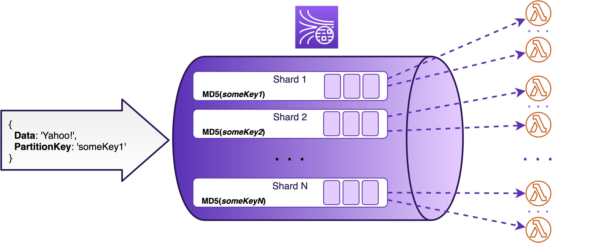
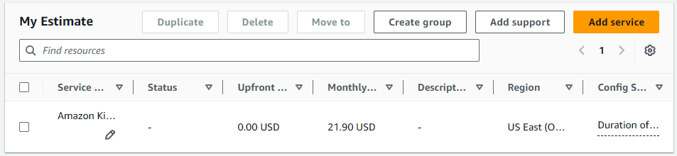
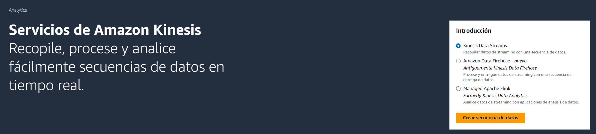
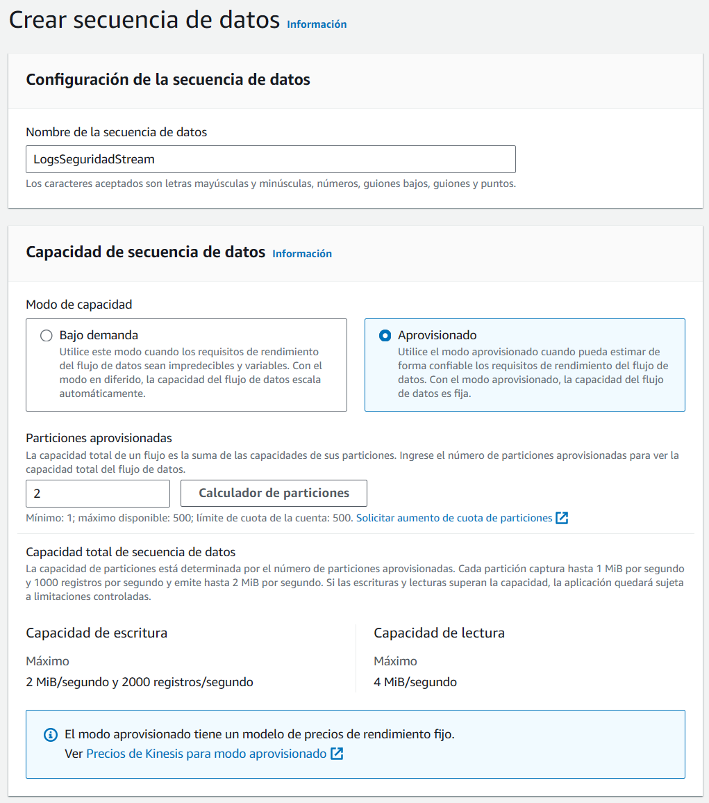
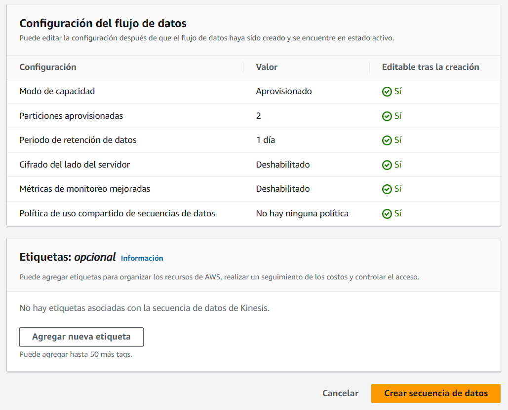

# AWS Kinesis Data Streams

## ¿Qué es?

Amazon Kinesis Data Streams es un servicio de AWS que permite la ingesta y procesamiento de grandes volúmenes de datos en tiempo real. Está diseñado para manejar flujos de datos a gran escala provenientes de diversas fuentes, como logs de aplicaciones, clics en sitios web, transacciones financieras, entre otros. Kinesis proporciona una forma confiable y escalable de capturar, procesar y almacenar datos de streaming para aplicaciones que requieren análisis en tiempo real.

**Características clave de Kinesis Data Streams:**

- **Ingesta en tiempo real**: Captura datos tan pronto como se generan.
- **Escalabilidad masiva**: Puede manejar desde megabytes hasta terabytes de datos por hora.
- **Procesamiento en tiempo real**: Permite a las aplicaciones reaccionar inmediatamente a los datos entrantes.
- **Integración con otros servicios de AWS**: Se integra fácilmente con Lambda, S3, Redshift, entre otros.


### ¿Por qué es necesario?

En nuestro proyecto de **Ciberseguridad Proactiva S.L.**, necesitamos procesar grandes volúmenes de logs de seguridad en tiempo real para detectar amenazas y generar alertas inmediatas. Los dispositivos de seguridad (firewalls, sistemas de detección de intrusos, etc.) generan logs constantemente, y es crucial analizar estos datos al instante para prevenir posibles ataques.

**Beneficios de utilizar Kinesis Data Streams en nuestro caso:**

- **Ingesta eficiente de datos**: Kinesis puede recibir logs de múltiples fuentes simultáneamente sin perder datos.
- **Baja latencia**: Los datos están disponibles para procesamiento en cuestión de milisegundos desde que se reciben.
- **Escalabilidad automática**: A medida que aumenta el volumen de logs, Kinesis se escala para manejar la carga sin necesidad de intervención manual.
- **Integración con AWS Lambda**: Podemos configurar Lambda para que procese los datos de Kinesis en tiempo real, ejecutando nuestros algoritmos de detección de amenazas.

Al utilizar Kinesis Data Streams, garantizamos que nuestro sistema de detección de amenazas sea altamente receptivo y pueda manejar grandes cantidades de datos sin comprometer el rendimiento.



## Estimación de costos

Para estimar los costos asociados a **Amazon Kinesis Data Streams**, utilizaremos la calculadora de AWS y consideraremos valores estimados específicos para nuestro caso de estudio, como el número de shards, volumen de datos y otros factores relevantes.

1. **Región**: US East (Ohio)

2. **Shards (fragmentos)**:

   Un shard en Kinesis Data Streams puede manejar hasta 1 MB/s de entrada y 2 MB/s de salida. Cada shard tiene un costo por hora.

   | Concepto                 | Configuración                 | Comentario                                |
   | ------------------------ | ----------------------------- | ----------------------------------------- |
   | Capacidad por shard      | 1 MB/s entrada, 2 MB/s salida |                                           |
   | Costo por shard por hora | $0.015                        | Puede variar según la región seleccionada |

3. **Volumen de datos**:

   - **Total de logs generados**: 100 GB al día.
   - **Equivalente en MB/s**: 1.16 MB/s (100 GB / 86,400 segundos).

4. **Cálculo del número de shards**:

   Dado que un shard maneja 1 MB/s de entrada, necesitaremos al menos **2 shards** para cubrir nuestro volumen de datos.

5. **Costo por shard**:

   | Concepto                | Cálculo                     | Costo      |
   | ----------------------- | --------------------------- | ---------- |
   | Costo por shard por mes | $0.015 x 24 horas x 30 días | $10.80     |
   | Costo total (2 shards)  | $10.80 x 2 instancias       | **$21.60** |

6. **Puts (registros de entrada)**:

   - El costo por millón de registros de entrada es de **$0.014**.
   - Si recibimos **10 millones** de registros al día:
     - **Total de registros al mes**: 10 millones x 30 días = 300 millones.
     - **Costo**: (300 millones / 1 millón) x $0.014 = **$4.20**

7. **Datos de transferencia**:

   - **Asunción**: El tráfico de salida está dentro del nivel gratuito o es mínimo, por lo que no se considera en el cálculo.

**Con la información anterior los costos son:**

| Concepto                                | Costo Mensual |
| --------------------------------------- | ------------- |
| Costo de shards (mensual)               | $21.60        |
| Costo de registros de entrada (mensual) | $4.20         |
| **Total**                               | **$25.80**    |



## Pasos detallados para despliegue

A continuación, se describen los pasos para configurar Amazon Kinesis Data Streams en nuestro entorno:

### 1. Crear un Stream de Kinesis

1. **Acceder a la consola de AWS** y navegar a **Amazon Kinesis**.
   

2. **Seleccionar "Data Streams"** y hacer clic en **"Crear un stream de datos"**.

   

3. **Configurar el stream**:

   - **Nombre del stream**: `LogsSeguridadStream`
   - **Modo de capacidad**: Seleccionar **"Provisioned"**.
   - **Número de shards**: Establecer en **2**.

   

4. **Crear el stream** haciendo clic en **"Crear un stream de datos de Kinesis"**.

### 2. Configurar productores de datos

Nuestros dispositivos de seguridad o aplicaciones deben enviar los logs al stream de Kinesis.

1. **Utilizar el SDK de AWS**, en este caso Python, para enviar datos al stream.

2. **Ejemplo de código en Python** para enviar logs a Kinesis:

   ```python
   import boto3
   import json

   kinesis_client = boto3.client('kinesis', region_name='us-east-1')

   def enviar_log(log_data):
       response = kinesis_client.put_record(
           StreamName='LogsSeguridadStream',
           Data=json.dumps(log_data),
           PartitionKey='partition_key'
       )
       return response

   # Ejemplo de log
   log_ejemplo = {
       'timestamp': '2023-10-10T12:34:56Z',
       'evento': 'Intento de acceso no autorizado',
       'origen': '192.168.1.100'
   }

   enviar_log(log_ejemplo)
   ```

   **Nota:** Asegurarse de configurar las credenciales de AWS adecuadamente.

3. **Implementar el código** en los dispositivos o aplicaciones que generen los logs.
