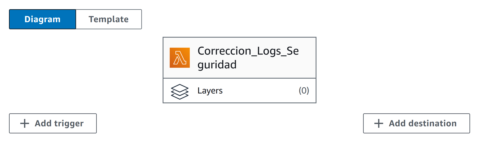

# AWS Lambda

## ¿Qué es?

Las funciones como servicio son súper prácticas porque te permiten ejecutar código sin tener que preocuparte por toda la infraestructura detrás. No necesitas configurar servidores, manejar la capacidad de cómputo, instalar sistemas operativos ni hacer mantenimiento. Solo te enfocas en tu código, y eso es todo. En el caso de AWS Lambda, la gran ventaja es su flexibilidad financiera: solo pagas por el tiempo que tu código se ejecuta, nada más. AWS se encarga del escalado y del mantenimiento por ti.

Pero Lambda no es el único servicio de este tipo. Microsoft tiene algo parecido en Azure, llamado Azure Functions, que básicamente hace lo mismo. Te permite desplegar código sin toda la complicación del backend. Además, es genial en términos de escalabilidad, despliegue fácil y soporte. Estos servicios se usan mucho para cosas como:

    • Procesamiento de flujos de datos.
    • Aplicaciones web que necesitan un backend ágil.
    • Procesamiento de archivos en la nube.
    • Backends para aplicaciones móviles.
    • Backends para dispositivos IoT.

Es decir, puedes enfocarte en crear y no tanto en mantener servidores.

### ¿Por qué es necesario?

La función Lambda es un paso clave para nosotros porque necesitamos detectar anomalías en los logs y generar alertas rápidamente, ya sea para los usuarios o para nosotros mismos. Queremos que esto suceda al instante o al menos en unos pocos minutos. Tener servidores encendidos todo el tiempo para lograr esa disponibilidad al 100% sería demasiado costoso, ya que implica mantener infraestructura siempre activa y asumir costos adicionales de configuración y mantenimiento.

Con Lambda, en cambio, solo se ejecuta el código cuando detectamos un posible ataque o alguna anomalía en los logs, lo que nos permite ahorrar costos y mantener la eficiencia.

Además, al estar en el ecosistema de AWS, es muy fácil integrarlo con otros servicios, como CloudWatch, que nos ayuda a monitorear los sistemas y activa Lambda cuando hace falta, o S3, para manejar los logs de forma sencilla. Es un enfoque que nos da mucha flexibilidad y control sin toda la complejidad de la infraestructura tradicional.

## Estimación de costos

Para estimar los costos con la calculadora de AWS, primero tenemos que considerar que los logs se generan de forma constante, pero no todo el tiempo. Por eso, asumimos que la función Lambda se ejecutará cada 10 minutos. Además, estimamos que el tiempo de ejecución promedio del código será de unos 25 segundos, para asegurarnos de que pueda completarse sin problemas.

Con estas consideraciones, llegamos a los costos estimados:

1. Región: US East (ohio)

2. Service Settings

| Concepto                     | Configuración | Comentario                                                            |
| ---------------------------- | ------------- | --------------------------------------------------------------------- |
| **Architecture**             | X86           |                                                                       |
| **Number of requests**       | 144 por día   | Estimando ejecutar la función cada 10 minutos                         |
| **Duration of each request** | 25 segundos   | Suficiente para que finalice el código                                |
| **Amount of Memory**         | 1 GB          | Suficiente para que aguante los datos que se necesiten en ese momento |

3. Provisioned Concurrency
   Esta función opcional al momento de crearla permite que la respuesta sea instantánea ya que el servicio estará preparado las 24 horas del día para ejecutarse, es muy importante en nuestro caso ya que son respuestas de seguridad.

| Concepto                 | Configuración | Comentario                                                            |
| ------------------------ | ------------- | --------------------------------------------------------------------- |
| Architecture             | X86           |                                                                       |
| Number of requests       | 144 por día   | Estimando ejecutar la función cada 10 minutos                         |
| Duration of each request | 25 segundos   | Suficiente para que finalice el código                                |
| Amount of Memory         | 1 GB          | Suficiente para que aguante los datos que se necesiten en ese momento |

**Con la información anterior los costos son:**

| Concepto                                           | Costo (USD)   |
| -------------------------------------------------- | ------------- |
| Lambda Cost (Monthly)                              | 1.82 USD      |
| Lambda costs for Provisioned Concurrency (Monthly) | 11.5 USD      |
| **Total**                                          | **13.32 USD** |

## Pasos detallados para despliegue

Para el despliegue de la función lambda necesaria en nuestro caso es el siguiente:

1. Ingresar a AWS

2. Buscar servicio Lambda

3. Seleccionar "Create function"

4. Seleccionar "Container image" ya que nosotros tenemos que conectarlo a una dependencia Docker

5. Asignar nombre y Buscar Docker container

6. Asignar arquitectura de x86

7. Asignar role de seguridad

8. Función Lambda Creada

9. Agregar trigger: se conectara con el servicio CloudWatch Logs

10. Flujo configurado

11. Configuración código para corregir fallas de seguridad

