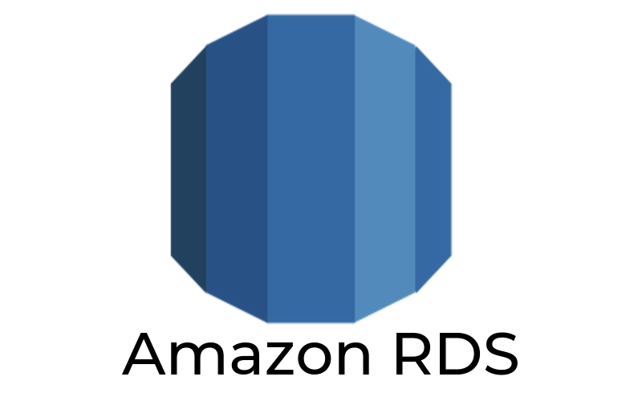
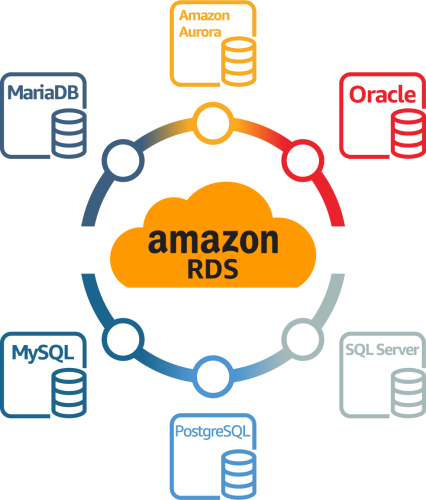
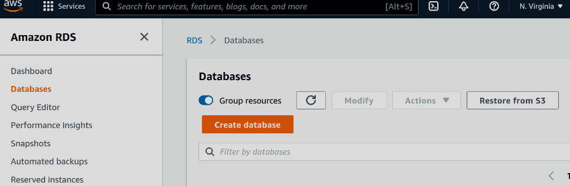
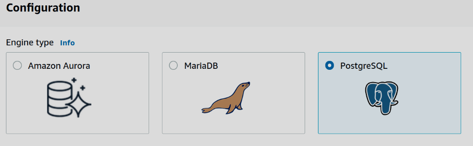
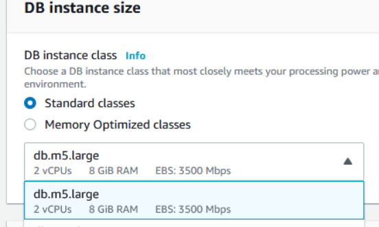
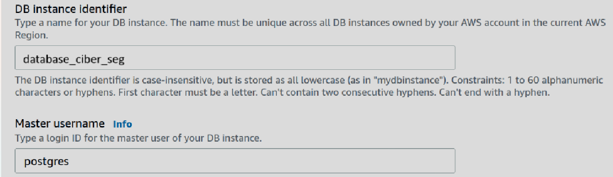
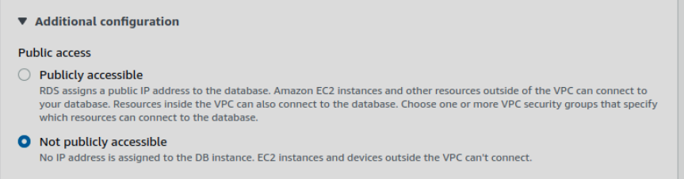
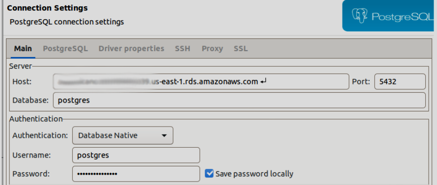

# AWS RDS

## ¿Qué es?

Amazon Relational Database Service (Amazon RDS) es un servicio de base de datos relacional fácil de administrar, optimizada para el costo total de propiedades. Ofrece una colección de servicios administrados que facilita las tareas de configuración, operación y escalado de una base de datos en la nube. Amazon RDS elimina procesos manuales que resultan pesados, lo que le permite centrarse en la aplicación y en los usuarios.

### ¿Por qué es necesario?

Para este caso de uso es necesario RDS para almacenar la información de eventos de seguridad, es decir los logs procesados. Con este servicio podemos utilizar el motor de base de datos que más sea conveniente y asegurándonos de que automáticamente se administren las copias de seguridad, la aplicación de parches de software, la detección automática de errores y la recuperación teniendo a su vez, una alta disponibilidad.

Además con este servicio tenemos la flexibilidad para escalar los recursos de almacenamiento asociados con las bases de datos de forma fácil y sin tiempo de inactividad tanto de forma vertical, con el cambio a instancias más grande, como horizontal, es decir aumento del almacenamiento.

## Estimación de costos

Para la estimación de costos utilizamos la calculadora de AWS usando las características que más se adaptaban para este caso de estudio como se ve a continuación

1. **Instancias RDS**:

| Concepto                  | Configuración                     | Comentario                                                                    |
| ------------------------- | --------------------------------- | ----------------------------------------------------------------------------- |
| Amazon RDS for PostgreSQL | `db.m5.large` (2 vCPUs, 8 GB RAM) | para bases de datos de tamaño moderado. Suficiente para procesamiento de logs |
| Costo por hora            | Aproximadamente $0.356 USD        | Por instancia                                                                 |

2. **RDS Proxy**:

| Concepto         | Configuración               | Comentario                              |
| ---------------- | --------------------------- | --------------------------------------- |
| Amazon RDS proxy | Max (2 vCPUs, 2 ) = 2 vCPUs | Manejo de conexiones de forma eficiente |
| Costo por hora   | Aproximadamente $0.015 USD  | Por instancia                           |

3. **Storage**:

| Concepto                  | Configuración             | Comentario                                            |
| ------------------------- | ------------------------- | ----------------------------------------------------- |
| General Purpose SSD (gp2) | 200GB                     | Capacidad de almacenamiento para el conjunto de datos |
| Costo por mes             | Aproximadamente $0.23 USD | Por instancia                                         |

4. **Backup Storage**:

| Concepto          | Configuración                 | Comentario                      |
| ----------------- | ----------------------------- | ------------------------------- |
| Additional backup | 100 GB x 0.095 USD = 9.50 USD | Copia de seguridad de los datos |
| Costo por mes     | Aproximadamente $0.23 USD     | Por instancia                   |

5. **Resumen de costos por año**:

| Concepto                                              | Configuración |
| ----------------------------------------------------- | ------------- |
| Costo por mes RDS Proxy:                              | $21.90 USD    |
| Costo por mes de Instancias Amazon RDS PostgreSQL     | $259.88 USD   |
| Costo por mes de Almacenamiento                       | $46.00 USD    |
| Costo por mes de Copia de seguridad de Almacenamiento | $46.00 USD    |

## Pasos detallados para despliegue

En AWS buscamos el servicio RDS y creamos una nueva base de datos

Seleccionamos el motos de base de datos deseado en este caso Postgress

Seleccionamos el tamaño de la instancia para la base de datos db.m5.large

Creamos el nombre para la instancia junto con las credenciales del usuario master

Por seguridad, la base de datos no debe estar habilitada para acceso público

Crear un grupo de seguridad para controlar el tráfico que puede llegar y salir de la base de datos (VPC)

Check connection from local in Postgres to AWS RDS

