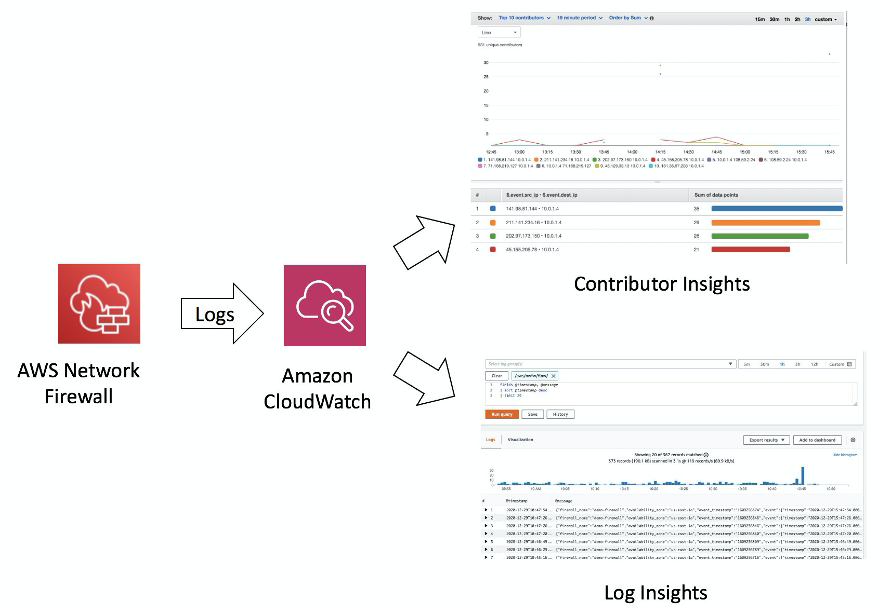

# AWS S3

## ¿Qué es?

Amazon S3 (Simple Storage Service) es un servicio de almacenamiento en la nube que permite guardar y recuperar grandes volúmenes de datos de manera sencilla y segura. S3 proporciona almacenamiento de objetos, lo cual es ideal para almacenar logs, copias de seguridad y cualquier tipo de archivo que requiera ser accesible de forma confiable.

En este caso, S3 se utilizará para almacenar los logs de seguridad generados por las instancias EC2 y otros servicios, facilitando la gestión de los mismos y permitiendo su análisis posterior o almacenamiento a largo plazo.

### ¿Por qué es necesario?

El uso de Amazon S3 es necesario por las siguientes razones:

Almacenamiento escalable: S3 permite almacenar cualquier cantidad de datos sin preocuparse por la capacidad. Esto es crucial para manejar el creciente volumen de logs generados por los servicios de seguridad.

Alta disponibilidad y durabilidad: Amazon S3 asegura una alta disponibilidad y durabilidad de los datos, lo que garantiza que los logs estarán accesibles cuando se necesiten.

Integración con otros servicios: S3 se integra fácilmente con otros servicios de AWS, como Lambda y CloudWatch, lo cual facilita la automatización de procesos y la detección de amenazas en tiempo real.

Eficiencia de costos: S3 permite ahorrar en costos de almacenamiento, ya que ofrece diferentes clases de almacenamiento según la frecuencia de acceso a los datos, como S3 Standard, S3 Infrequent Access, y S3 Glacier.

## Estimación de costos

1. **Volumen de almacenamiento**:

   | Concepto        | Configuración          | Comentario                           |
   | --------------- | ---------------------- | ------------------------------------ |
   | Almacenamiento  | 200 GB                 | Logs de seguridad                    |
   | Costo por GB    | $0.023                 | Para S3 Standard                     |
   | Costo total     | 200 GB x $0.023        | $4.60                                |

2. **Transferencia de datos**:

   - **Asunción**: El tráfico de salida está dentro del nivel gratuito o es mínimo, por lo que no se considera en el cálculo.

**Con la información anterior los costos son:**

| Concepto                              | Costo Mensual |
| ------------------------------------- | ------------- |
| Costo de almacenamiento S3 (mensual)  | $4.60         |
| **Total**                             | **$4.60**     |

## Pasos detallados para despliegue para S3

1. **Crear bucket S3**:
   - Iniciar sesión en AWS Management Console y navegar a Amazon S3.
   - Seleccionar "Create bucket" y proporcionar un nombre único para el bucket.
   - Elegir la región en la que se almacenarán los datos para minimizar la latencia y los costos de transferencia.
   - Configurar permisos y opciones avanzadas según las necesidades del proyecto.

2. **Configurar políticas de acceso**:
   - Definir políticas de acceso para el bucket, asegurándose de que solo usuarios autorizados puedan acceder a los logs.
   - Opcionalmente, habilitar políticas de versión para conservar versiones anteriores de los archivos y tener un historial completo de los cambios.

3. **Integrar S3 con EC2**:
   - Configurar las instancias EC2 para que envíen los logs de seguridad al bucket S3.
   - Esto se puede hacer mediante scripts que se ejecuten automáticamente o mediante el uso de AWS SDK para Python (boto3) para automatizar la carga de archivos.

4. **Configurar ciclo de vida del bucket**:
   - Definir reglas de ciclo de vida para mover automáticamente los logs de seguridad a clases de almacenamiento más económicas, como S3 Glacier, después de un período determinado.
   - Esto ayudará a reducir costos de almacenamiento a largo plazo, manteniendo solo los datos más recientes en S3 Standard para un acceso rápido.

