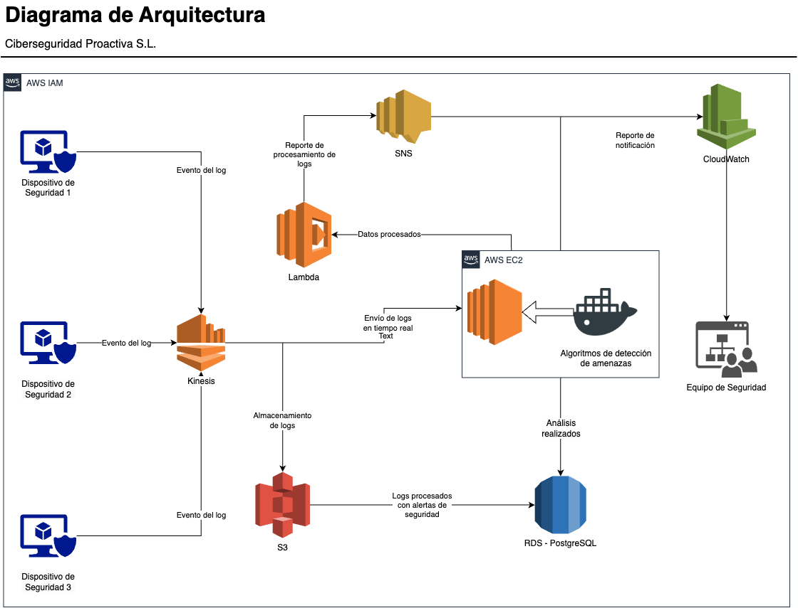

# Diagrama de arquitectura de la solución propuesta

> Figura 1: Diagrama de arquitectura de la solución propuesta

## Descripción del Diagrama de Arquitectura

Este representa la arquitectura que hemos diseñado para "Ciberseguridad Proactiva S.L.", enfocada en ofrecer una solución robusta y escalable para el análisis de logs de seguridad y la detección proactiva de amenazas. Nuestra propuesta aprovecha los servicios en la nube de AWS para garantizar eficiencia, seguridad y capacidad de respuesta en tiempo real.

## Componentes Principales del Diagrama

1. **Dispositivos de Seguridad (1, 2, 3)**

   - Hemos configurado los dispositivos de seguridad para que generen eventos de log esenciales para la detección de amenazas. Estos logs son enviados a través de **AWS Kinesis Data Streams** para su procesamiento en tiempo real.

2. **AWS Kinesis Data Streams**

   - Utilizamos Kinesis como punto central de ingesta de los logs provenientes de los dispositivos de seguridad. Esto asegura un flujo continuo y gestionable de datos hacia nuestros sistemas de procesamiento.

3. **Amazon S3**

   - Los logs se almacenan en Amazon S3 para mantener un registro histórico y facilitar análisis posteriores. Este almacenamiento nos permite conservar grandes volúmenes de datos de forma segura y rentable.

4. **Amazon EC2 (Algoritmos de Detección de Amenazas)**

   - Desplegamos instancias EC2 que ejecutan nuestros algoritmos de detección de amenazas contenerizados con Docker. Estas instancias acceden a los logs almacenados en S3 para realizar análisis más profundos y generar reportes detallados.

5. **AWS Lambda**

   - Implementamos funciones Lambda para recibir los logs procesados bajo las amenazas detectadas y generar el envío de las alertas a través de SNS.

6. **Amazon RDS (PostgreSQL)**

   - Configuramos una base de datos RDS con PostgreSQL para almacenar los logs procesados y los resultados de los análisis realizados por EC2 y Lambda, incluyendo las alertas de seguridad generadas.

7. **Amazon SNS y Amazon CloudWatch**

   - **Amazon SNS (Simple Notification Service):** Lo utilizamos para enviar notificaciones y alertas al equipo de seguridad tras la detección de amenazas.
   - **Amazon CloudWatch:** Monitorea continuamente la infraestructura y los logs, permitiéndonos configurar alarmas y obtener métricas en tiempo real para una respuesta rápida ante cualquier incidente.

8. **Equipo de Seguridad**

   - El equipo de seguridad recibe las notificaciones y tiene acceso a los reportes generados, lo que les permite actuar de manera proactiva y eficiente ante posibles amenazas.
